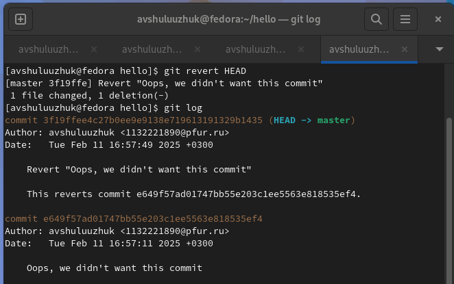

---
## Front matter
lang: ru-RU
title: Работа с git
subtitle: Лабораторная работа № 1
author:
  - Шулуужук А. В.
institute:
  - Российский университет дружбы народов, Москва, Россия
date: 12 февраль 2025

## i18n babel
babel-lang: russian
babel-otherlangs: english

## Formatting pdf
toc: false
toc-title: Содержание
slide_level: 2
aspectratio: 169
section-titles: true
theme: metropolis
header-includes:
 - \metroset{progressbar=frametitle,sectionpage=progressbar,numbering=fraction}
 - '\makeatletter'
 - '\beamer@ignorenonframefalse'
 - '\makeatother'
---

## Цели и задачи

Научиться пользоваться с git и разобраться с его особенностями. 

# Выполнение лабораторной работы

##

{#fig:001 width=70%}

##

{#fig:002 width=70%}

##

{#fig:003 width=70%}

##

{#fig:004 width=70%}

## 

{#fig:005 width=70%}

##

{#fig:006 width=70%}

##

{#fig:007 width=70%}

##

{#fig:008 width=70%}

##

{#fig:009 width=70%}

## 

{#fig:010 width=70%}

##

{#fig:011 width=70%}

## 

{#fig:012 width=70%}

## 

{#fig:013 width=70%}

##

{#fig:014 width=70%}

##

{#fig:015 width=70%}

##

{#fig:016 width=70%}

##

{#fig:017 width=70%}

##

{#fig:018 width=70%}

## 

{#fig:019 width=70%}

##

{#fig:020 width=70%}

## 

{#fig:021 width=70%}

##

{#fig:022 width=70%}

##

{#fig:023 width=70%}

##

{#fig:024 width=70%}

##

{#fig:025 width=70%}

##

{#fig:026 width=70%}

##

{#fig:027 width=70%}

##

{#fig:028 width=70%}

##

{#fig:029 width=70%}

##

{#fig:030 width=70%}

##

{#fig:031 width=70%}

##

{#fig:032 width=70%}

##

{#fig:033 width=70%}

##

{#fig:034 width=70%}

##

{#fig:035 width=70%}

##

{#fig:036 width=70%}

##

{#fig:037 width=70%}

##

{#fig:038 width=70%}

##

{#fig:039 width=70%}

##

{#fig:040 width=70%}

##

{#fig:041 width=70%}

##

{#fig:042 width=70%}

##

{#fig:043 width=70%}

##

{#fig:044 width=70%}

## 

{#fig:045 width=70%}

##

{#fig:046 width=70%}

##

{#fig:047 width=70%}

##

{#fig:048 width=70%}

##

{#fig:049 width=70%}

##

{#fig:050 width=70%}

##

{#fig:051 width=70%}

##

{#fig:052 width=70%}

##

{#fig:053 width=70%}

##

{#fig:054 width=70%}

##

{#fig:055 width=70%}

##

{#fig:056 width=70%}

##

{#fig:057 width=70%}

##

{#fig:058 width=70%}

##

{#fig:059 width=70%}

##

{#fig:060 width=70%}

##
{#fig:061 width=70%}

##

{#fig:062 width=70%}

## Выводы

В результате выполнения лабораторной работы научились пользоваться с git и разобрались с его особенностями. 
