---
## Front matter
title: "Работа с git"
subtitle: "Лабораторная работа № 1"
author: "Шулуужук Айраана НПИбд-02-22"

## Generic otions
lang: ru-RU
toc-title: "Содержание"

## Bibliography
bibliography: bib/cite.bib
csl: pandoc/csl/gost-r-7-0-5-2008-numeric.csl

## Pdf output format
toc: true # Table of contents
toc-depth: 2
lof: true # List of figures
lot: true # List of tables
fontsize: 12pt
linestretch: 1.5
papersize: a4
documentclass: scrreprt
## I18n polyglossia
polyglossia-lang:
  name: russian
  options:
	- spelling=modern
	- babelshorthands=true
polyglossia-otherlangs:
  name: english
## I18n babel
babel-lang: russian
babel-otherlangs: english
## Fonts
mainfont: IBM Plex Serif
romanfont: IBM Plex Serif
sansfont: IBM Plex Sans
monofont: IBM Plex Mono
mathfont: STIX Two Math
mainfontoptions: Ligatures=Common,Ligatures=TeX,Scale=0.94
romanfontoptions: Ligatures=Common,Ligatures=TeX,Scale=0.94
sansfontoptions: Ligatures=Common,Ligatures=TeX,Scale=MatchLowercase,Scale=0.94
monofontoptions: Scale=MatchLowercase,Scale=0.94,FakeStretch=0.9
mathfontoptions:
## Biblatex
biblatex: true
biblio-style: "gost-numeric"
biblatexoptions:
  - parentracker=true
  - backend=biber
  - hyperref=auto
  - language=auto
  - autolang=other*
  - citestyle=gost-numeric
## Pandoc-crossref LaTeX customization
figureTitle: "Рис."
tableTitle: "Таблица"
listingTitle: "Листинг"
lofTitle: "Список иллюстраций"
lotTitle: "Список таблиц"
lolTitle: "Листинги"
## Misc options
indent: true
header-includes:
  - \usepackage{indentfirst}
  - \usepackage{float} # keep figures where there are in the text
  - \floatplacement{figure}{H} # keep figures where there are in the text
---

# Цель работы

Научиться пользоваться с git и разобраться с его особенностями. 

# Выполнение лабораторной работы

Выполним следующие команды, чтобы git узнал наше имя и электронную почту (рис. [-@fig:001])

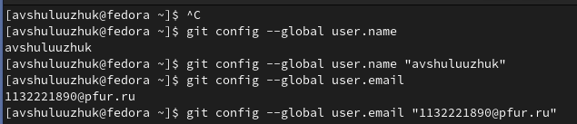{#fig:001 width=70%}

Установим параметры установки окончаний строк и отображения unicode (рис. [-@fig:002])

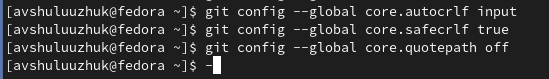{#fig:002 width=70%}

Начнем работу в пустом рабочем каталоге с создания пустого каталога с именем hello, затем войдем в него и создадим там файл с именем hello.html (рис. [-@fig:003])

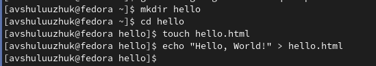{#fig:003 width=70%}

Создаим репозиторий из этого каталога и добаввим файл в него. Далее проверим состояние репозитория (рис. [-@fig:004]).

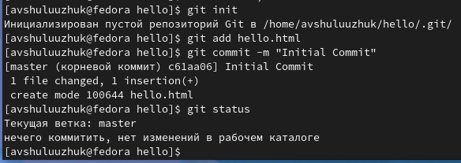{#fig:004 width=70%}

Добавим HTML-теги к нашему приветствию. Изменим содержимое файла hello.html (рис. [-@fig:005]). 
Проверим состояние рабочего каталога (рис. [-@fig:006])

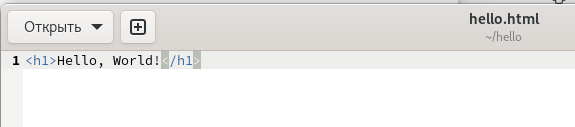{#fig:005 width=70%}

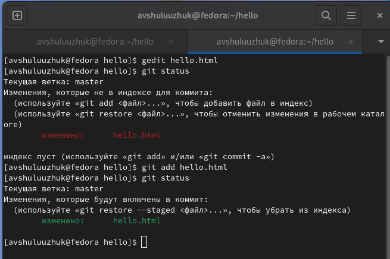{#fig:006 width=70%}

Теперь выполним команду git, чтобы проиндексировать изменения. Проверим его состояние. Далее сделаем коммит и проверим состояние (рис. [-@fig:007]).

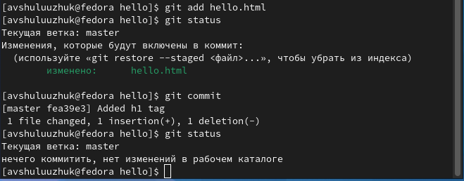{#fig:007 width=70%}

Изменим страницу «Hello, World», чтобы она содержала стандартные теги html и body. И добавим это изменение в индексе git (рис. [-@fig:008]).

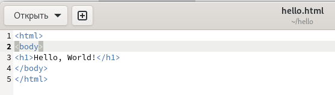{#fig:008 width=70%}

Теперь добавим заголовки HTML (секцию head) к странице «Hello, World» (рис. [-@fig:009]).

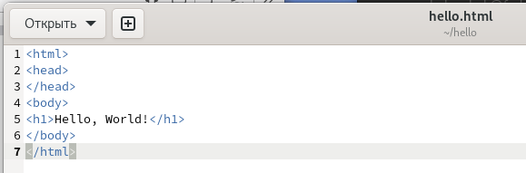{#fig:009 width=70%}

Проверим текущий статус (рис. [-@fig:010]).

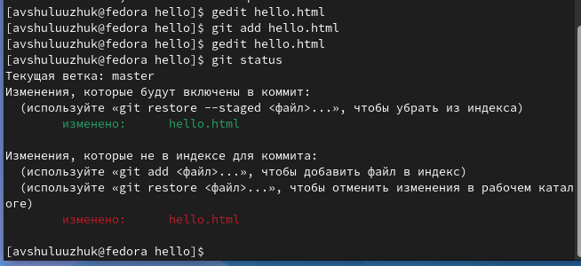{#fig:010 width=70%}

Произведем коммит проиндексированного изменения (значение по умолчанию), а затем еще раз проверим состояние. Состояние команды говорит о том, что hello.html имеет незафиксированные изменения, но уже не в буферной зоне. Теперь добавим второе изменение в индекс, а затем проверим состояние с помощью команды git status. Второе изменение было проиндексировано и готово к коммиту. Сделаем коммит второго изменения (рис. [-@fig:011]).

{#fig:011 width=70%}

Получим список произведенных изменений (рис. [-@fig:012]).

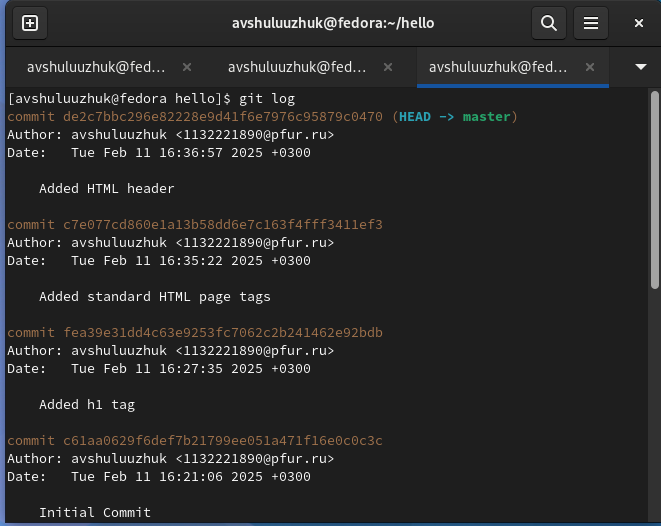{#fig:012 width=70%}

Варианты отображения лога (рис. [-@fig:013]).

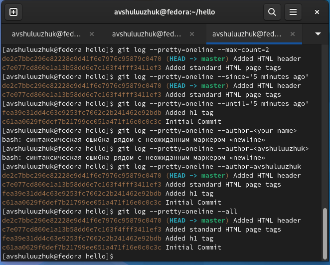{#fig:013 width=70%}

Изучим данные лога и найдем хэш для первого коммита. Используем этот хэш-код (достаточно первых 7 знаков). Затем проверим содержимое файла hello.html (рис. [-@fig:014]).

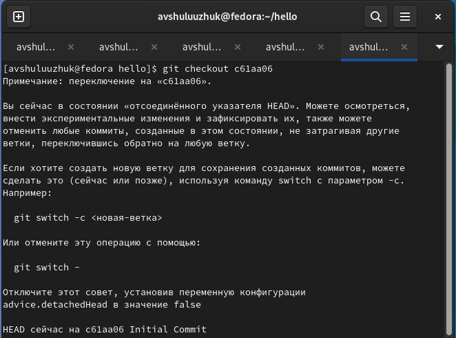{#fig:014 width=70%}

Вернемся к последней версии в ветке master (рис. [-@fig:015]).

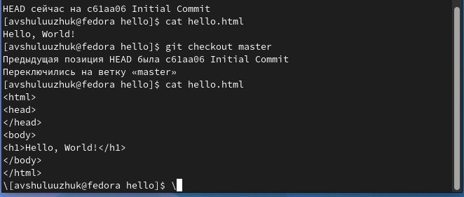{#fig:015 width=70%}

Назовем текущую версию страницы hello первой (v1). Создадим тег первой версии. Теперь текущая версия страницы называется v1. Создадим тег для версии, которая идет перед текущей версией и назовем его v1-beta (рис. [-@fig:016]).

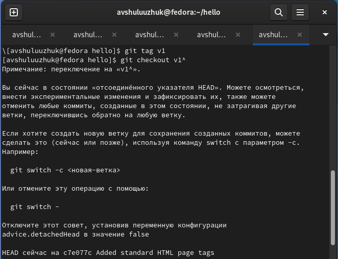{#fig:016 width=70%}

Просмотрим файл hello.html (рис. [-@fig:017]).

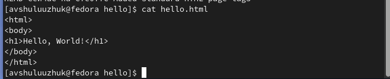{#fig:017 width=70%}

Это версия c тегами <html> и <body>, но еще пока без <head>. Сделаем ее версией v1-beta. Попробуем попереключаться между двумя отмеченными версиями (рис. [-@fig:018]).

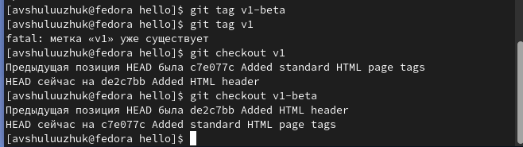{#fig:018 width=70%}

Убедимся, что мы находимся на последнем коммите ветки master, прежде чем продолжить работу. Внесем изменение в файл hello.html в виде нежелательного комментария. Проверим состояние рабочего каталога. Мы видим, что файл hello.html был изменен, но еще не проиндексирован (рис. [-@fig:019]) (рис. [-@fig:020]).

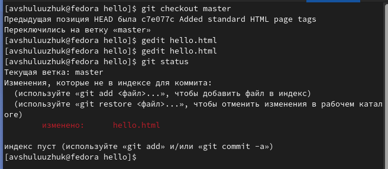{#fig:019 width=70%}

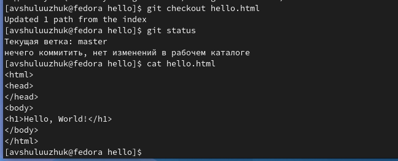{#fig:020 width=70%}

Внесем изменение в файл hello.html в виде нежелательного комментария и проиндексируем это изменение. Проверим состояние нежелательного изменения (рис. [-@fig:021]).

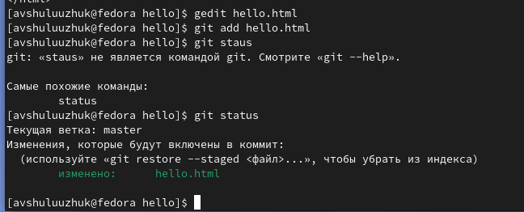{#fig:021 width=70%}

Вывод состояния показывает нам именно то, что мы должны сделать для отмены индексации изменения. Переключимся на версию коммита и проверим состояние каталога. Видим, что рабочий каталога снова чист (рис. [-@fig:022])

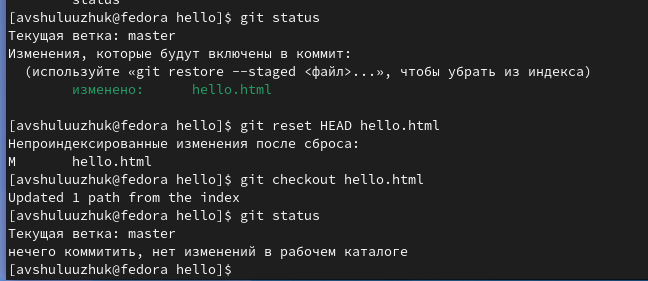{#fig:022 width=70%}

Изменим файл hello.html и сделаем коммит (рис. [-@fig:023])

{#fig:023 width=70%}

Чтобы отменить коммит, нам необходимо сделать коммит, который удаляет изменения, сохраненные нежелательным коммитом. Проверим лог (рис. [-@fig:024])

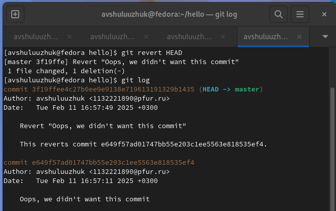{#fig:024 width=70%}

Сделаем быструю проверку нашей истории коммитов. Мы видим, что два последних коммита в этой ветке — «Oops» и «Revert Oops». Удалим их с помощью сброса. Для начала отметим эту ветку. Но прежде чем удалить коммиты, отметим последний коммит тегом, чтобы потом можно было его найти. Сбросим ветку до этой точки. Поскольку ветка имеет тег, мы можем использовать имя тега в команде сброса (рис. [-@fig:025]). 

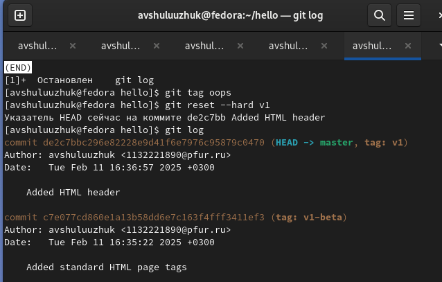{#fig:025 width=70%}

Тег oops свою функцию выполнил. Удалим его и коммиты, на которые он ссылался, сборщиком мусора. Тег «oops» больше не будет отображаться в репозитории (рис. [-@fig:026]).

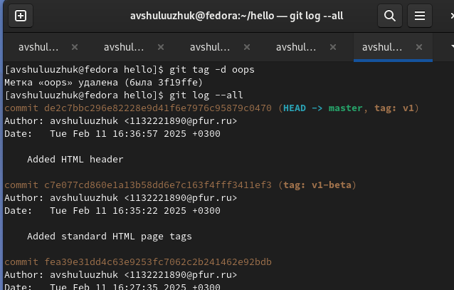{#fig:026 width=70%}

Изменим страницу, а затем сделаем коммит. Добавим в страницу комментарий автора (вставим свою фамилию) (рис. [-@fig:027]).

{#fig:027 width=70%}

После совершения коммита мы понимаем, что любой хороший комментарий должен включать электронную почту автора. Обновите страницу hello, включив в нее email. (рис. [-@fig:028]).

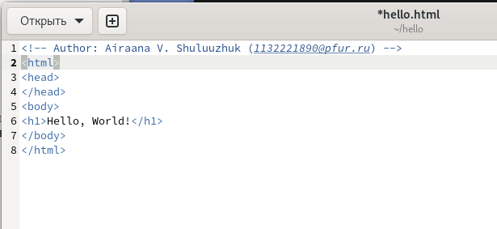{#fig:028 width=70%}

Изменим предыдущий коммит, включив в него адрес электронной почты (рис. [-@fig:029]).

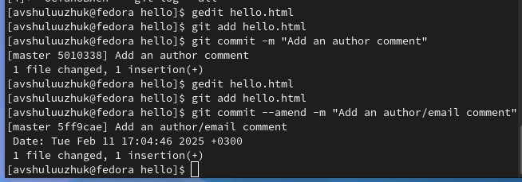{#fig:029 width=70%}

Переместим файл hello.html в каталог lib. Создадим структуру нашего репозитория. Перенесем страницу в каталог lib (рис. [-@fig:030]).

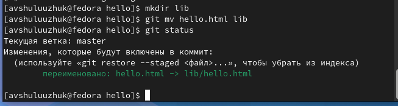{#fig:030 width=70%}

Сделаем коммит этого перемещения (рис. [-@fig:031]).

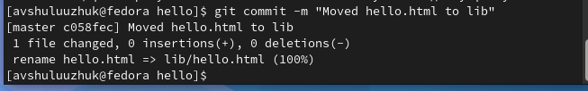{#fig:031 width=70%}

Добавим файл index.html в наш репозиторий и сделаем коммит (рис. [-@fig:032]) (рис. [-@fig:033]).

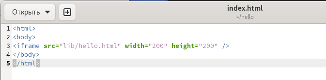{#fig:032 width=70%}

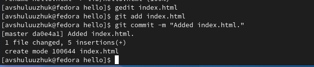{#fig:033 width=70%}

Теперь при открытии index.html, мы видим кусок страницы hello в маленьком окошке (рис. [-@fig:034]).

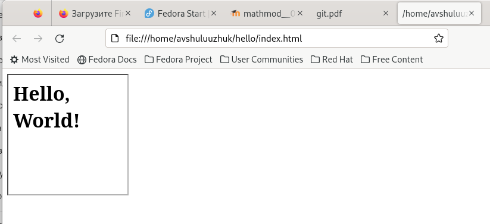{#fig:034 width=70%}

Каталог .git. Это каталог, в котором хранится вся информация git. Просмотрим набор каталогов, имена которых состоят из 2 символов. Имена каталогов являются первыми двумя буквами хэша sha1 объекта, хранящегося в git (рис. [-@fig:035]).

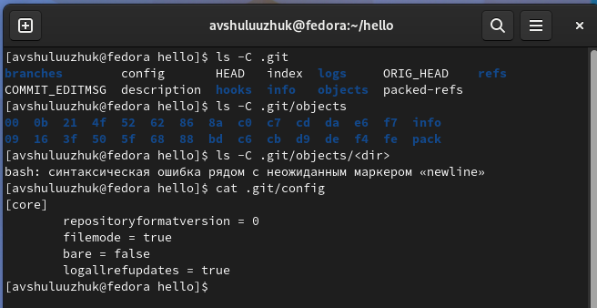{#fig:035 width=70%}

Просмотрим файл конфигурации. Это файл конфигурации, создающийся для каждого конкретного проекта. Записи в этом файле будут перезаписывать записи в файле .gitconfig главного каталога, по крайней мере в рамках этого проекта. (рис. [-@fig:036]).

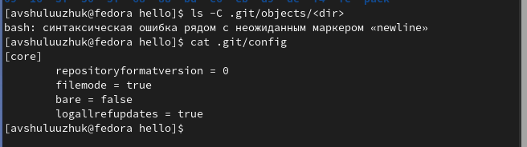{#fig:036 width=70%}

Просмотрим ветки и теги. Каждый файл соответствует тегу, ранее созданному с помощью команды git tag. Его содержание — это всего лишь хэш коммита, привязанный к тегу (рис. [-@fig:037]).

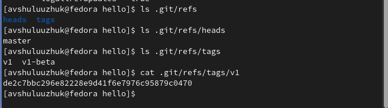{#fig:037 width=70%}

Работа непосредственно с объектами git. Просмотрим последний коммит. Эта команда должна показать последний коммит в репозиторий и выведем последний коммит с помощью SHA1 хэша (рис. [-@fig:038]).

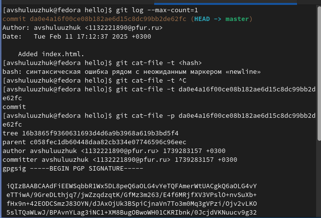{#fig:038 width=70%}

Выведем дерево каталогов, ссылка на который идет в коммите. Это должно быть описание файлов (верхнего уровня) в нашем проекте (для конкретного коммита). Используем SHA1 хэш из строки «дерева», из списка выше. Выведем каталога lib и файл hello.html (рис. [-@fig:039])

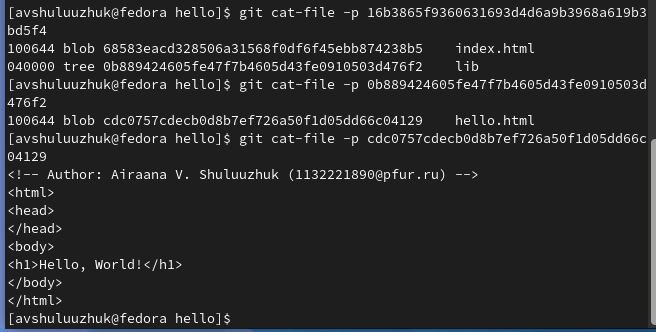{#fig:039 width=70%}

Создадим ветку. Назовем нашу новую ветку «style». Добавим изменения в файл стилей и выполним коммит (рис. [-@fig:040]).

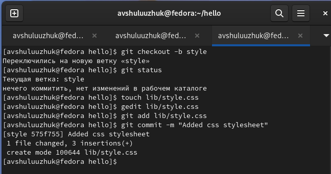{#fig:040 width=70%}

Обновим файл hello.html, чтобы использовать стили style.css и выполним коммит (рис. [-@fig:041]).

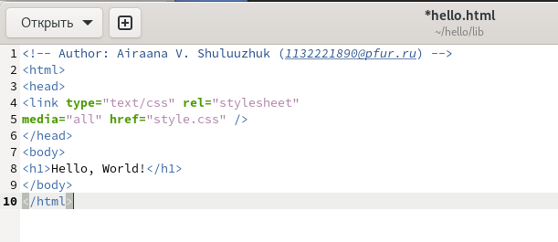{#fig:041 width=70%}

Обновим файл index.html, чтобы он тоже использовал style.css и выполним коммит (рис. [-@fig:042])

{#fig:042 width=70%}

Теперь в нашем проекте есть две ветки (рис. [-@fig:043])

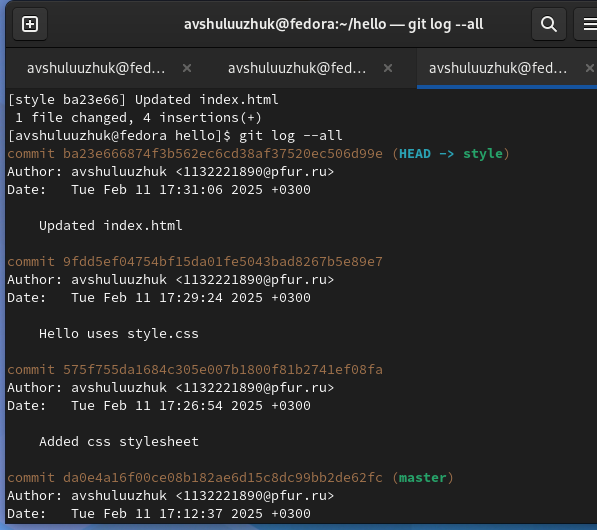{#fig:043 width=70%}

Используем команду git checkout для переключения между ветками. Мы находимся на ветке master. Это заметно по тому, что файл hello.html не использует стили style.css (рис. [-@fig:044])

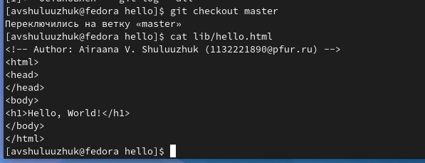{#fig:044 width=70%}

Вернемся к ветке style. Содержимое lib/hello.html подтверждает, что мы вернулись на ветку style (рис. [-@fig:045]). 

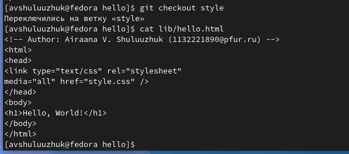{#fig:045 width=70%}

Теперь у нас в репозитории есть две отличающиеся ветки. Используем следующую лог-команду для просмотра веток и их отличий (рис. [-@fig:046]).

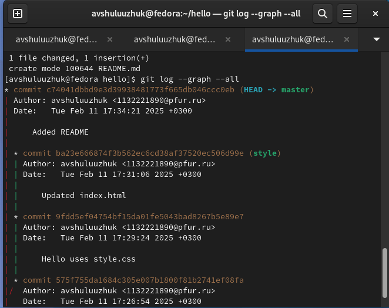{#fig:046 width=70%}

Теперь вернемся к ветке style и попытаемся объединить ее с новой веткой master. Если мы откроем lib/hello.html, мы увидим (рис. [-@fig:047]).

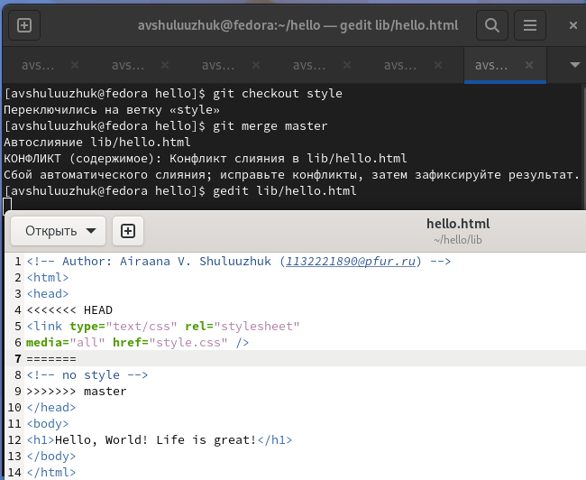{#fig:047 width=70%}

Необходимо вручную разрешить конфликт. Внесем изенения в lib/hello.html для достижения следующего результата и сделаем коммит решения коммита (рис. [-@fig:048]).

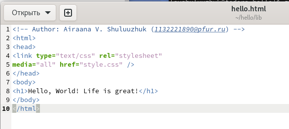{#fig:048 width=70%}

Для сброса ветки style нам необходимо найти последний коммит перед слиянием (рис. [-@fig:049]).

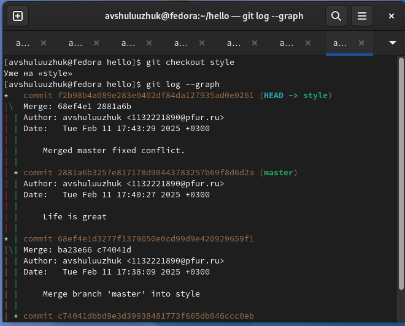{#fig:049 width=70%}

Мы видим, что коммит «Updated index.html» был последним на ветке style перед слиянием. Cбросим ветку style к этому коммиту. Проверим ветку. Поищем лог ветки style. У нас в истории больше нет коммитов слияний (рис. [-@fig:050]).

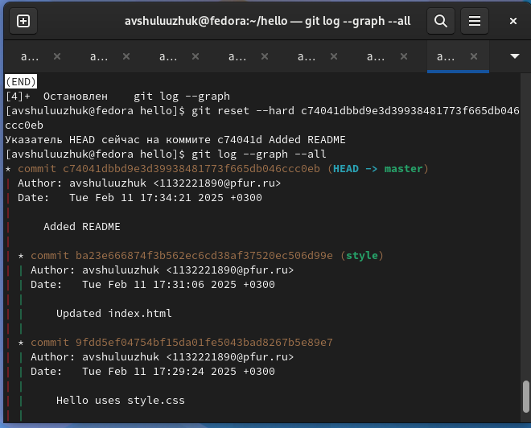{#fig:050 width=70%}

Просмотрим лог историй. Теперь ветки style и master идентичны (рис. [-@fig:051]).

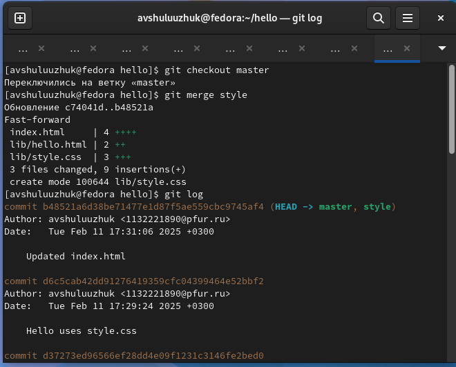{#fig:051 width=70%}

Перейдем в рабочий каталог и сделаем клон репозитория hello. Сейчас мы находимся в рабочем каталоге.
В этот момент вы должны находиться в «рабочем» каталоге. Здесь должен быть единственный репозиторий под названием «hello». Создадим клон репозитория. В вашем рабочем каталоге теперь должно быть два репозитория: оригинальный
репозиторий «hello» и клонированный репозиторий «cloned_hello» (рис. [-@fig:052])

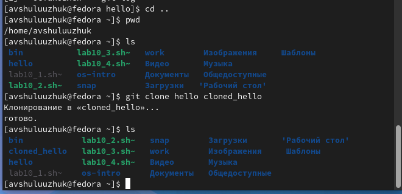{#fig:052 width=70%}

Взглянем на клонированный репозиторий. Увидем список всех файлов на верхнем уровне оригинального репозитория
README.md, index.html и lib. Просмотрим историю репозитория (рис. [-@fig:053]).

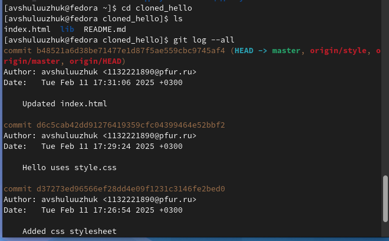{#fig:053 width=70%}

Выполним git remote. Мы видим, что клонированный репозиторий знает об имени по умолчанию удаленного репозитория. Посмотрим, можем ли мы получить более подробную информацию об имени по умолчанию (рис. [-@fig:054]).

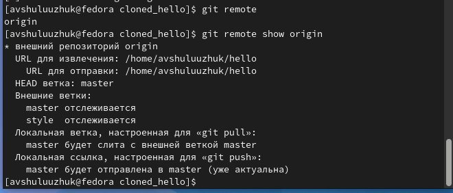{#fig:054 width=70%}

Посмотрим на ветки, доступные в нашем клонированном репозитории. Как мы видим, в списке только ветка master. Команда git branch выводит только список локальных веток по умолчанию. Для того, чтобы увидеть все ветки, попробуйте следующую команду: git branch -a. Git выводит все коммиты в оригинальный репозиторий, но ветки в удаленном
репозитории не рассматриваются как локальны (рис. [-@fig:055]).

{#fig:055 width=70%}

Внесем изменения в оригинальный репозиторий hello. Сейчас мы находимся в репозитории hello. Внесем следующие изменения в файл README.md: This is the Hello World example from the git tutorial. Теперь добавим это изменение и сделаем коммит. Теперь в оригинальном репозитории есть более поздние изменения, которых нет в клонированной версии. Далее мы извлечем и сольем эти изменения в клонированный репозиторий (рис. [-@fig:056]).

{#fig:056 width=70%}

Научимся извлекать изменения из удаленного репозитория. Сейчас мы находимся в репозитории cloned_hello (рис. [-@fig:057]).

{#fig:057 width=70%}

Сольем извлеченные изменения в локальную ветку master. Еще раз проверим файл README.md. Мы должны увидеть изменения. Команда git fetch не сливает изменения, мы можем вручную слить изменения из удаленного репозитория. Теперь рассмотрим объединение fetch и merge в одну команду (рис. [-@fig:058]).

{#fig:058 width=70%}

Добавим локальную ветку, которая отслеживает удаленную ветку. Теперь можем видеть ветку style в списке веток и логе (рис. [-@fig:059])

{#fig:059 width=70%}

Создадим чистый репозиторий. Сейчас мы находимся в рабочем каталоге (рис. [-@fig:060]).

{#fig:060 width=70%}

Добавим репозиторий hello.git к нашему оригинальному репозиторию. Так как чистые репозитории, как правило, расшариваются на каком-нибудь сетевом сервере, нам необходимо отправить наши изменения в другие репозитории.
Начнем с создания изменения для отправки. Отредактируем файл README.md и сделаем коммит. Теперь отправим изменения в общий репозиторий. Общим называется репозиторий, получающий отправленные нами изменения (рис. [-@fig:061]).

{#fig:061 width=70%}

Научимся извлекать изменения из общего репозитория. Быстро переключимся в клонированный репозиторий и извлечем изменения, только что отправленные в общий репозиторий. Сейчас мы находимся в репозитории cloned_hello (рис. [-@fig:062]).

{#fig:062 width=70%}

# Выводы

В результате выполнения лабораторной работы научились пользоваться с git и разобрались с его особенностями. 

