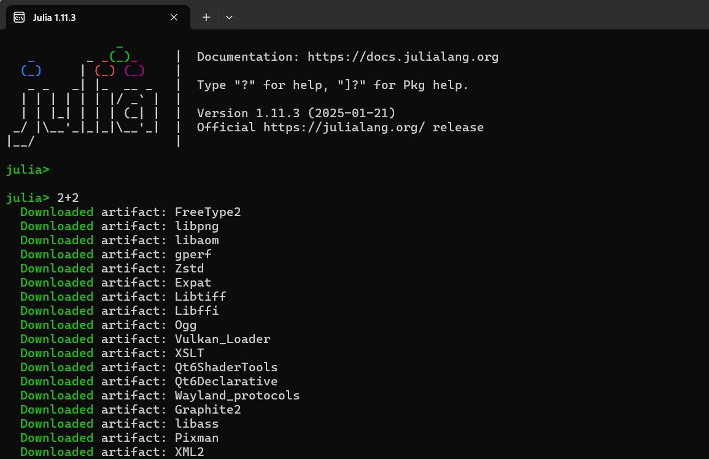
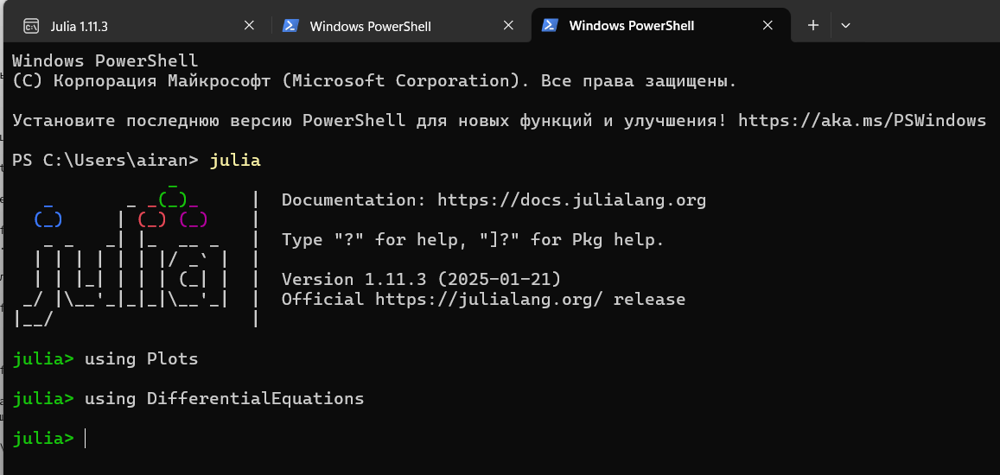

---
## Front matter
lang: ru-RU
title: Математическое моделирование. Задача о погоне
subtitle: Лабораторная работа № 2
author:
  - Шулуужук А. В.
institute:
  - Российский университет дружбы народов, Москва, Россия
date: 07 март 2025

## i18n babel
babel-lang: russian
babel-otherlangs: english

## Formatting pdf
toc: false
toc-title: Содержание
slide_level: 2
aspectratio: 169
section-titles: true
theme: metropolis
header-includes:
 - \metroset{progressbar=frametitle,sectionpage=progressbar,numbering=fraction}
 - '\makeatletter'
 - '\beamer@ignorenonframefalse'
 - '\makeatother'
---

## Цели и задачи

Научиться построению математических моделей для выбора правильной стратегии при решении задач поиска

# Выполнение лабораторной работы

## Определение номера варианта задания 

{#fig:001 width=70%}

## Задание

На море в тумане катер береговой охраны преследует лодку браконьеров. Через определенный промежуток времени туман рассеивается, и лодка обнаруживается на расстоянии 10,5 км от катера. Затем лодка снова скрывается в тумане и уходит прямолинейно в неизвестном направлении. Известно, что скорость катера в 4,3 раза больше скорости браконьерской лодки.

## 

Пусть время t - время, через которое катер и лодка окажутся на одном расстоянии от начальной точки. 

$$ t = \frac{x}{v} $$

$$ t = \frac{10,5 - x}{4,3v} $$

$$ t = \frac{10,5 + x}{4,3v} $$

##

Из этих уравнений получаем объединение двух уравнений:

$$ \begin{bmatrix} 
	\frac{x}{v} = \frac{10,5 - x}{4,3v} \\
	\frac{x}{v} = \frac{10,5 + x}{4,3v} 
\end{bmatrix} $$

##

Из данных уравнений можно найти расстояние, после которого катер начнет раскручиваться по спирали. В результате получаем для x следующее:

$$ x_1 = \frac{105}{53} $$

$$ x_2 = \frac{105}{33} $$

## 

Радиальная скорость:

$$ v_r = \frac{dr}{dt} $$

Тангенциальная скорость:

$$ v_\tau = \frac{\sqrt{1749}v}{10} $$

##

Решение задачи сводится к решению системы из двух дифференциальных уравнений

$$ (1) \frac{dr}{dt} = v $$

$$ (2) r\frac{d\theta}{dt} = \frac{\sqrt{1749}v}{10} $$

##

$$ \theta_0 = 0 $$

$$ r_0 = x_1 = \frac{105}{53} $$

или

$$ \theta_0 = -\pi $$

$$ r_0 = x_2 = \frac{105}{33} $$

##

Исключая из полученной системы производную по t, можно перейти к следующему уравнению:

$$ \frac{dr}{d\theta} = \frac{10r}{\sqrt{1749}} $$

##

{#fig:002 width=70%}

## 

{#fig:003 width=70%}

##

{#fig:004 width=70%}

## 

{#fig:005 width=70%}

## 

{#fig:006 width=70%}

## Выводы

В результате выполнения лабораторной работы были получены основы языка программирования Julia. Научились построению математических моделей для выбора правильной стратегии при решении задач поиска. Были построены графики для обоих случаев, где отрисованы тракетории движения катера и лодки, также получилось наглядно найти точку их пересечения.

