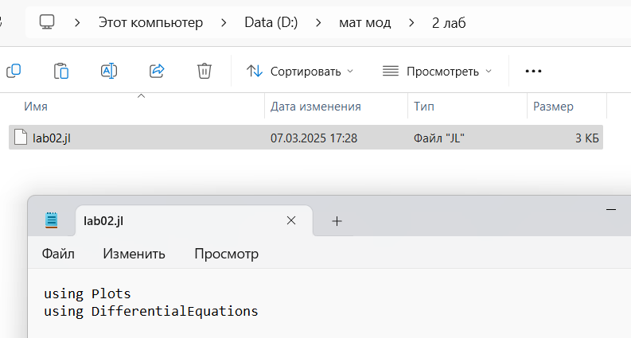
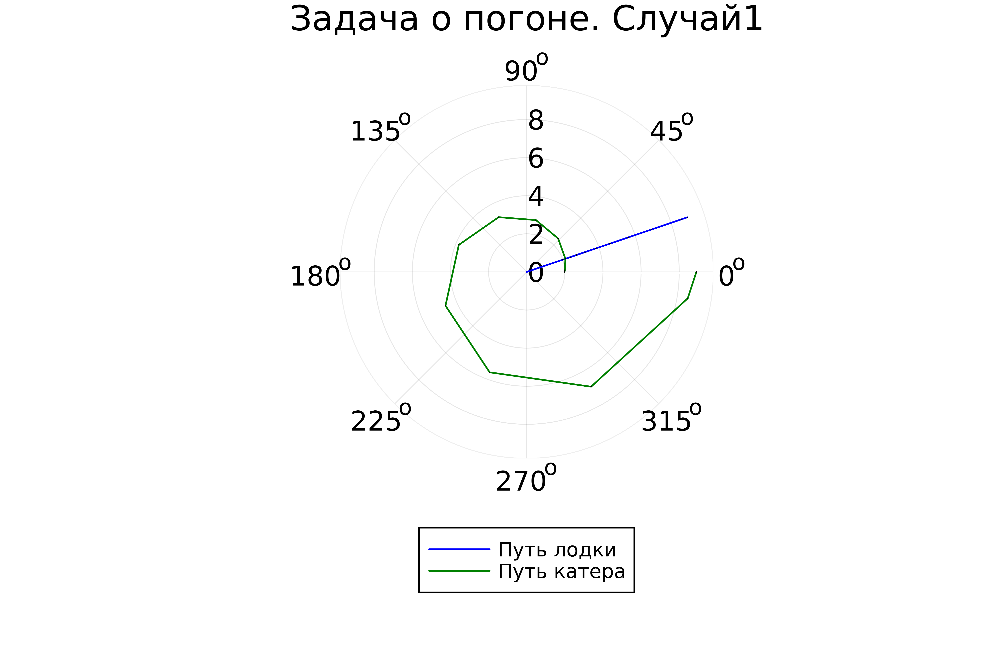
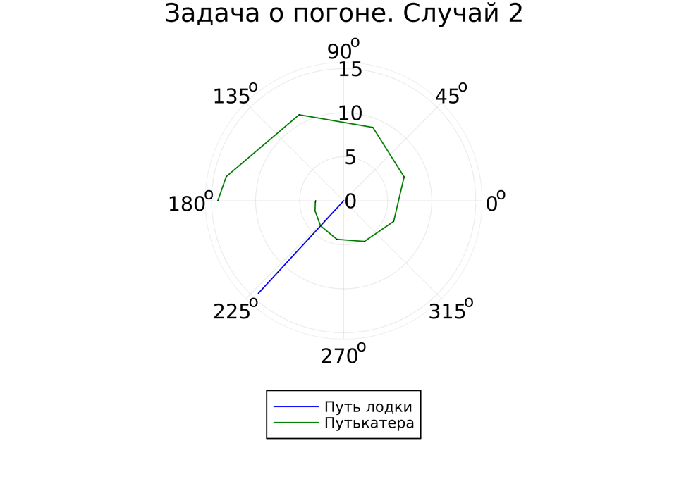

---
## Front matter
title: "Задача о погоне"
subtitle: "Лабораторная работа № 2"
author: "Шулуужук Айраана НПИбд-02-22"

## Generic otions
lang: ru-RU
toc-title: "Содержание"

## Bibliography
bibliography: bib/cite.bib
csl: pandoc/csl/gost-r-7-0-5-2008-numeric.csl

## Pdf output format
toc: true # Table of contents
toc-depth: 2
lof: true # List of figures
lot: true # List of tables
fontsize: 12pt
linestretch: 1.5
papersize: a4
documentclass: scrreprt
## I18n polyglossia
polyglossia-lang:
  name: russian
  options:
	- spelling=modern
	- babelshorthands=true
polyglossia-otherlangs:
  name: english
## I18n babel
babel-lang: russian
babel-otherlangs: english
## Fonts
mainfont: IBM Plex Serif
romanfont: IBM Plex Serif
sansfont: IBM Plex Sans
monofont: IBM Plex Mono
mathfont: STIX Two Math
mainfontoptions: Ligatures=Common,Ligatures=TeX,Scale=0.94
romanfontoptions: Ligatures=Common,Ligatures=TeX,Scale=0.94
sansfontoptions: Ligatures=Common,Ligatures=TeX,Scale=MatchLowercase,Scale=0.94
monofontoptions: Scale=MatchLowercase,Scale=0.94,FakeStretch=0.9
mathfontoptions:
## Biblatex
biblatex: true
biblio-style: "gost-numeric"
biblatexoptions:
  - parentracker=true
  - backend=biber
  - hyperref=auto
  - language=auto
  - autolang=other*
  - citestyle=gost-numeric
## Pandoc-crossref LaTeX customization
figureTitle: "Рис."
tableTitle: "Таблица"
listingTitle: "Листинг"
lofTitle: "Список иллюстраций"
lotTitle: "Список таблиц"
lolTitle: "Листинги"
## Misc options
indent: true
header-includes:
  - \usepackage{indentfirst}
  - \usepackage{float} # keep figures where there are in the text
  - \floatplacement{figure}{H} # keep figures where there are in the text
---

# Цель работы

Научиться построению математических моделей для выбора правильной стратегии при решении задач поиска.

# Задание

1. Запишите уравнение, описывающее движение катера, с начальными условиями для двух случаев (в зависимости от расположения катера относительно лодки в начальный момент времени).
2. Постройте траекторию движения катера и лодки для двух случаев.
3. Найдите точку пересечения траектории катера и лодки.

# Выполнение лабораторной работы

Определим вариант задания по формуле: (SnmodN)+1, где Sn — номер студбилета, N — количество заданий. В результате получаем вариант - 31 (рис. [-@fig:001])

{#fig:001 width=70%}

На море в тумане катер береговой охраны преследует лодку браконьеров. Через определенный промежуток времени туман рассеивается, и лодка обнаруживается на расстоянии 10,5 км от катера. Затем лодка снова скрывается в тумане и уходит прямолинейно в неизвестном направлении. Известно, что скорость катера в 4,3 раза больше скорости браконьерской лодки.

Момент отсчета времени - момент первого рассеивания тумана.

Траектория катера должна быть такой, чтобы и катер, и лодка все время были на одном расстоянии от полюса , только в этом случае траектория катера пересечется с траекторией лодки. Поэтому для начала катер береговой охраны должен двигаться некоторое время прямолинейно, пока не окажется на том же расстоянии от полюса, что и лодка браконьеров. После этого катер береговой охраны должен двигаться вокруг полюса удаляясь от него с той же скоростью, что и лодка
браконьеров. 

Пусть время t - время, через которое катер и лодка окажутся на одном расстоянии от начальной точки. 

$$ t = \frac{x}{v} $$

$$ t = \frac{10,5 - x}{4,3v} $$

$$ t = \frac{10,5 + x}{4,3v} $$

Из этих уравнений получаем объединение двух уравнений:

$$ \begin{bmatrix} 
	\frac{x}{v} = \frac{10,5 - x}{4,3v} \\
	\frac{x}{v} = \frac{10,5 + x}{4,3v} 
\end{bmatrix} $$

Из данных уравнений можно найти расстояние, после которого катер начнет раскручиваться по спирали. В результате получаем для x следующее:

$$ x_1 = \frac{105}{53} $$

$$ x_2 = \frac{105}{33} $$

Задачу будем решать для двух случаев.

Радиальная скорость:

$$ v_r = \frac{dr}{dt} $$

Тангенциальная скорость:

$$ v_\tau = \frac{\sqrt{1749}v}{10} $$

Решение задачи сводится к решению системы из двух дифференциальных уравнений

$$ (1) \frac{dr}{dt} = v $$

$$ (2) r\frac{d\theta}{dt} = \frac{\sqrt{1749}v}{10} $$

с начальными условиями

$$ \theta_0 = 0 $$

$$ r_0 = x_1 = \frac{105}{53} $$

или

$$ \theta_0 = -\pi $$

$$ r_0 = x_2 = \frac{105}{33} $$

Исключая из полученной системы производную по t, можно перейти к следующему уравнению:

$$ \frac{dr}{d\theta} = \frac{10r}{\sqrt{1749}} $$

Решением этого уравнения с заданными начальными условиями будет являться траекторией движения катера в полярных координатах.

Установим Julia и необходимые для работы пакеты (рис. [-@fig:002]) (рис. [-@fig:003])

{#fig:002 width=70%}

{#fig:003 width=70%}

Создаем файл lab02.jl. В этом файле прописываем код (рис. [-@fig:004]).

{#fig:004 width=70%}

Код программы: 
```
using Plots
using DifferentialEquations

const k = 10.5
const n = 4.3

const r0 = k/(n+1)
const r0_2 = k/(n-1)

const T = (0, 2*pi)
const T_2 = (-pi, pi)

function F(u, p, t)
  return u / sqrt(n*n - 1)
end

problem = ODEProblem(F, r0, T)

result = solve(problem, abstol=1e-8, reltol=1e-8)

dxR = rand(1:size(result.t)[1]) 
rAngles = [result.t[dxR] for i in 1:size(result.t)[1]]

plt = plot(proj=:polar, aspect_ratio=:equal, dpi = 1000, legend=true, bg=:white)

plot!(plt, xlabel="theta", ylabel="r(t)", title="Задача о погоне. Случай1", legend=:outerbottom)

plot!(plt, [rAngles[1], rAngles[2]], [0.0, result.u[size(result.u)[1]]], label="Путь лодки", color=:blue, lw=1) 
scatter!(plt, rAngles, result.u, label="", mc=:blue, ms=0.0005)

plot!(plt, result.t, result.u, xlabel="theta", ylabel="r(t)", label="Путь катера",
color=:green, lw=1) 
scatter!(plt, result.t, result.u, label="", mc=:green, ms=0.0005)

savefig(plt, "lab2_01.png")

problem=ODEProblem(F, r0_2 , T_2) 
result = solve(problem, abstol=1e-8, reltol=1e-8) 
dxR = rand(1:size(result.t)[1]) 
rAngles = [result.t[dxR] for i in 1:size(result.t)[1]]

plt1 = plot(proj=:polar, aspect_ratio=:equal, dpi = 1000, legend=true, bg=:white)

plot!(plt1, xlabel="theta", ylabel="r(t)", title="Задача о погоне. Случай 2", legend=:outerbottom)

plot!(plt1, [rAngles[1], rAngles[2]], [0.0, result.u[size(result.u)[1]]], label="Путь лодки", color=:blue, lw=1) 
scatter!(plt1, rAngles, result.u, label="", mc=:blue, ms=0.0005) 
plot!(plt1, result.t, result.u, xlabel="theta", ylabel="r(t)", label="Путькатера", color=:green, lw=1) 
scatter!(plt1, result.t, result.u, label="", mc=:green,
ms=0.0005)
savefig(plt1, "lab2_02.png")
```

Результаты для первого случая (рис. [-@fig:005])

{#fig:005 width=70%}

Результаты для второго случая (рис. [-@fig:006])

{#fig:006 width=70%}

# Выводы

В результате выполнения лабораторной работы были получены основы языка программирования Julia. Научились построению математических моделей для выбора правильной стратегии при решении задач поиска. Были построены графики для обоих случаев, где отрисованы тракетории движения катера и лодки, также получилось наглядно найти точку их пересечения.

