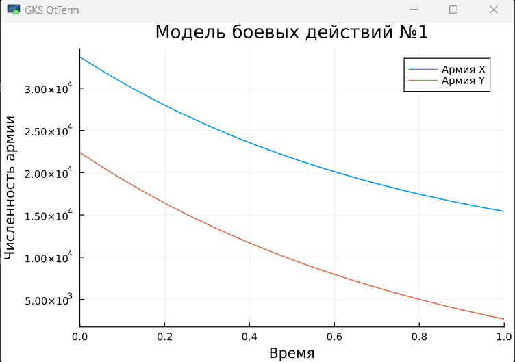

---
## Front matter
lang: ru-RU
title: Математическое моделирование. Модель боевых действий
subtitle: Лабораторная работа № 3
author:
  - Шулуужук А. В.
institute:
  - Российский университет дружбы народов, Москва, Россия
date: 22 март 2025

## i18n babel
babel-lang: russian
babel-otherlangs: english

## Formatting pdf
toc: false
toc-title: Содержание
slide_level: 2
aspectratio: 169
section-titles: true
theme: metropolis
header-includes:
 - \metroset{progressbar=frametitle,sectionpage=progressbar,numbering=fraction}
 - '\makeatletter'
 - '\beamer@ignorenonframefalse'
 - '\makeatother'
---

## Цели и задачи

Построение графиков расматриваемых моделей.

# Выполнение лабораторной работы

## Определение номера варианта задания 

{#fig:001 width=70%}

## Задание

Между страной Х и страной У идет война. Численность состава войск исчисляется от начала войны, и являются временными функциями x(t) и y(t). В начальный момент времени страна Х имеет армию численностью 33 700 человек, а в распоряжении страны У армия численностью в 22 400 человек. Для упрощения модели считаем, что коэффициенты a, b, c, h постоянны. Также считаем P(t) и Q(t) непрерывные функции.

## 

Модель боевых действий между регулярными войсками

$$ \frac{dx}{dt} = -0,44x(t)-0,78y(t)+sin(3t)+1 $$

$$ \frac{dy}{dt} = -0,56x(t)-0,66y(t)+cos(3t)+1 $$

##

Начальные условия:

$$ x_0 = 33700 $$

$$ y_0 = 22400 $$

##

Построим численное решение задачи.
Используем необходимые пакеты для работы:

```
using DifferentialEquations
using Plots
```

## 

Создаем вектор из 4 коэффициентов:

```
p1 = [0.44, 0.78, 0.56, 0.66]
```

##

Функция описывающая модель:

```
function f1(u, p, t)
	x, y = u
	a, b, c, h = p
	dx = -a*x - b*y + sin(3*t)+1
	dy = -c*x - h*y + cos(3*t)+1
	return [dx, dy]
	end
```

##

```
prob1 = ODEProblem(f1, [x0, y0], tspan, p1)
```

```
solution1 = solve(prob1, Tsit5())
```

```
plot(solution1, title = "Модель боевых действий 1", label = ["Армия Х" "Армия Y"], xaxis = "Время", yaxis = "Численность армии")
```

##

{#fig:002 width=70%}

##

Модель ведение боевых действий с участием регулярных войск и партизанских отрядов

$$ \frac{dx}{dt} = -0,37x(t)-0,79y(t)+sin(2t)+1 $$

$$ \frac{dy}{dt} = -0,27x(t)y(t)-0,78y(t)+cos(2t)+1 $$

## 

Создаем вектор из 4 коэффициентов:

```
p2 = [0.37, 0.79, 0.27, 0.78]
```

##

Функция описывающая модель:

```
function f2(u, p, t)
	x, y = u
	a, b, c, h = p
	dx = -a*x - b*y + sin(2*t)+1
	dy = -c*x*y - h*y + cos(2*t)+1
	return [dx, dy]
	end
```

## 

```
prob2 = ODEProblem(f2, [x0, y0], tspan, p2)
```

```
solution2 = solve(prob2, Tsit5())
```

```
plot(solution2, title = "Модель боевых действий 2", label = ["Армия Х" "Армия Y"], xaxis = "Время", yaxis = "Численность армии")
```

## 

{#fig:003 width=70%}

## Выводы

В результате выполнения лабораторной работы были получены основы языка программирования Julia. Были построены графики расмотренных моделей.
