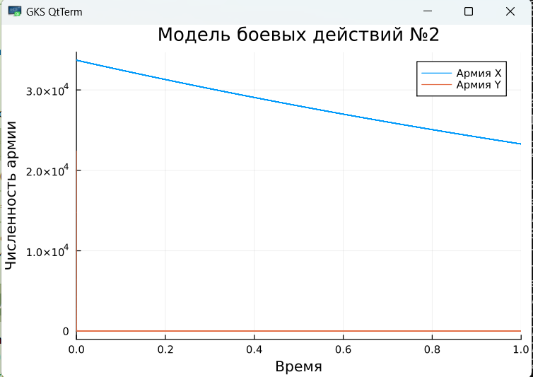

---
## Front matter
title: "Модель боевых действий"
subtitle: "Лабораторная работа № 3"
author: "Шулуужук Айраана НПИбд-02-22"

## Generic otions
lang: ru-RU
toc-title: "Содержание"

## Bibliography
bibliography: bib/cite.bib
csl: pandoc/csl/gost-r-7-0-5-2008-numeric.csl

## Pdf output format
toc: true # Table of contents
toc-depth: 2
lof: true # List of figures
lot: true # List of tables
fontsize: 12pt
linestretch: 1.5
papersize: a4
documentclass: scrreprt
## I18n polyglossia
polyglossia-lang:
  name: russian
  options:
	- spelling=modern
	- babelshorthands=true
polyglossia-otherlangs:
  name: english
## I18n babel
babel-lang: russian
babel-otherlangs: english
## Fonts
mainfont: IBM Plex Serif
romanfont: IBM Plex Serif
sansfont: IBM Plex Sans
monofont: IBM Plex Mono
mathfont: STIX Two Math
mainfontoptions: Ligatures=Common,Ligatures=TeX,Scale=0.94
romanfontoptions: Ligatures=Common,Ligatures=TeX,Scale=0.94
sansfontoptions: Ligatures=Common,Ligatures=TeX,Scale=MatchLowercase,Scale=0.94
monofontoptions: Scale=MatchLowercase,Scale=0.94,FakeStretch=0.9
mathfontoptions:
## Biblatex
biblatex: true
biblio-style: "gost-numeric"
biblatexoptions:
  - parentracker=true
  - backend=biber
  - hyperref=auto
  - language=auto
  - autolang=other*
  - citestyle=gost-numeric
## Pandoc-crossref LaTeX customization
figureTitle: "Рис."
tableTitle: "Таблица"
listingTitle: "Листинг"
lofTitle: "Список иллюстраций"
lotTitle: "Список таблиц"
lolTitle: "Листинги"
## Misc options
indent: true
header-includes:
  - \usepackage{indentfirst}
  - \usepackage{float} # keep figures where there are in the text
  - \floatplacement{figure}{H} # keep figures where there are in the text
---

# Цель работы

Построение графиков расматриваемых моделей.

# Выполнение лабораторной работы

Определим вариант задания по формуле: (SnmodN)+1, где Sn — номер студбилета, N — количество заданий. В результате получаем вариант - 31 (рис. [-@fig:001])

{#fig:001 width=70%}

Между страной Х и страной У идет война. Численность состава войск исчисляется от начала войны, и являются временными функциями x(t) и y(t). В начальный момент времени страна Х имеет армию численностью 33 700 человек, а в распоряжении страны У армия численностью в 22 400 человек. Для упрощения модели считаем, что коэффициенты a, b, c, h постоянны. Также считаем P(t) и Q(t) непрерывные функции.

Построем графики изменения численности войск армии Х и армии У для следующих случаев:

1. Модель боевых действий между регулярными войсками

$$ \frac{dx}{dt} = -0,44x(t)-0,78y(t)+sin(3t)+1 $$

$$ \frac{dy}{dt} = -0,56x(t)-0,66y(t)+cos(3t)+1 $$

Коэффициент смертности, не связанный с боевыми действиями у первой армии 0,44, у второй 0,66. Коэффициенты эффективности первой и второй армии 0,56 и 0,78 соответственно. Функция, описывающая подход подкрепление первой армии, P(t) = sin(3t)+1, подкрепление второй армии описывается функцией Q(t) = cos(3t)+1.

Начальные условия:

$$ x_0 = 33700 $$

$$ y_0 = 22400 $$

Построим численное решение задачи.
Используем необходимые пакеты для работы:

```
using DifferentialEquations
using Plots
```

Инициализируем начальные условия:

```
x0 = 33700
y0 = 22400
```

Создаем вектор из 4 коэффициентов:

```
p1 = [0.44, 0.78, 0.56, 0.66]
```

Функция описывающая модель:

```
function f1(u, p, t)
	x, y = u
	a, b, c, h = p
	dx = -a*x - b*y + sin(3*t)+1
	dy = -c*x - h*y + cos(3*t)+1
	return [dx, dy]
	end
```

```
prob1 = ODEProblem(f1, [x0, y0], tspan, p1)
```

```
solution1 = solve(prob1, Tsit5())
```

```
plot(solution1, title = "Модель боевых действий 1", label = ["Армия Х" "Армия Y"], xaxis = "Время", yaxis = "Численность армии")
```
Получаем график для первой модели (рис. [-@fig:002]) 

{#fig:002 width=70%}

2. Модель ведение боевых действий с участием регулярных войск и партизанских отрядов

$$ \frac{dx}{dt} = -0,37x(t)-0,79y(t)+sin(2t)+1 $$

$$ \frac{dy}{dt} = -0,27x(t)y(t)-0,78y(t)+cos(2t)+1 $$

Коэффициент смертности, не связанный с боевыми действиями у первой армии 0.37, у второй 0.78. Коэффициенты эффективности первой и второй армии 0.27 и 0.79 соответственно. Функция, описывающая подход подкрепление первой армии, P(t) = sin(2t)+1, подкрепление второй армии описывается функцией Q(t) = cos(2t)+1.

Начальные условия:

$$ x_0 = 33700 $$

$$ y_0 = 22400 $$

Построим численное решение задачи.

Создаем вектор из 4 коэффициентов:

```
p2 = [0.37, 0.79, 0.27, 0.78]
```

Функция описывающая модель:

```
function f2(u, p, t)
	x, y = u
	a, b, c, h = p
	dx = -a*x - b*y + sin(2*t)+1
	dy = -c*x*y - h*y + cos(2*t)+1
	return [dx, dy]
	end
```

```
prob2 = ODEProblem(f2, [x0, y0], tspan, p2)
```

```
solution2 = solve(prob2, Tsit5())
```

```
plot(solution2, title = "Модель боевых действий 2", label = ["Армия Х" "Армия Y"], xaxis = "Время", yaxis = "Численность армии")
```

Получаем график для второй модели (рис. [-@fig:003])

{#fig:003 width=70%}

# Выводы

В результате выполнения лабораторной работы были получены основы языка программирования Julia. Были построены графики расмотренных моделей.

