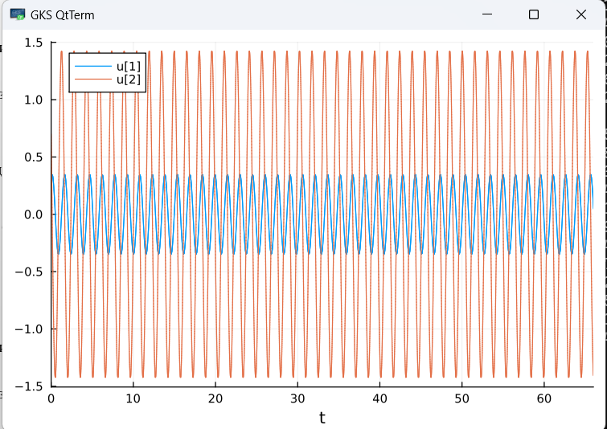
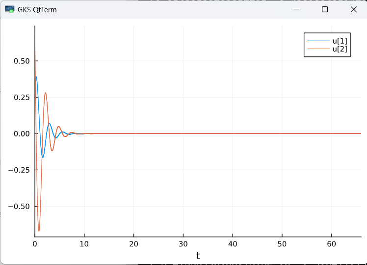

---
## Front matter
lang: ru-RU
title: Математическое моделирование. Модель гармонических колебаний
subtitle: Лабораторная работа № 4
author:
  - Шулуужук А. В.
institute:
  - Российский университет дружбы народов, Москва, Россия
date: 22 март 2025

## i18n babel
babel-lang: russian
babel-otherlangs: english

## Formatting pdf
toc: false
toc-title: Содержание
slide_level: 2
aspectratio: 169
section-titles: true
theme: metropolis
header-includes:
 - \metroset{progressbar=frametitle,sectionpage=progressbar,numbering=fraction}
 - '\makeatletter'
 - '\beamer@ignorenonframefalse'
 - '\makeatother'
---

## Цели и задачи

Изучить понятие гармонического осциллятора, построить фазовый портрет и найти решение уравнения гармонического осциллятора.

# Выполнение лабораторной работы

## Определение номера варианта задания 

{#fig:001 width=70%}

## Задание

Построить фазовый портрет гармонического осциллятора и решение уравнения гармонического осциллятора для следующих случаев

1. Колебания гармонического осциллятора без затуханий и без действий внешней силы $\ddot{x}+17x=0$;
2. Колебания гармонического осциллятора c затуханием и без действий внешней силы $\ddot{x}+1.7\dot{x}+6x=0$
3. Колебания гармонического осциллятора c затуханием и под действием внешней силы $\ddot{x}+3.6\dot{x}+8x=0.6cos(3t)$

На интервале $t\in [0;66]$ (шаг $0.05$) с начальными условиями $x_0=0.3, y_0=0.7$.

## 

Код программы для первого случая:

```
using DifferentialEquations
using Plots; gr()

function lorenz!(du, u, p, t)
    a = p
    du[1] = u[2]
    du[2] = -a*u[1]
end

const x = 0.3
const y = 0.7
u0 = [x, y]

p = (17)
tspan = (0.0, 66.0)
prob = ODEProblem(lorenz!, u0, tspan, p)
sol = solve(prob, dtmax = 0.05)

#решение системы уравнений
plot(sol)

#фазовый портрет
plot(sol, vars=(2,1))
```

##

{#fig:002 width=70%}

##

{#fig:003 width=70%}

## 

Код программы для второго случая:

```
using DifferentialEquations
using Plots; gr()

function lorenz!(du, u, p, t)
    a, b = p
    du[1] = u[2]
    du[2] = -a*du[1] - b*u[1] 
end

const x = 0.3
const y = 0.7
u0 = [x, y]

p = (sqrt(17), 6)
tspan = (0.0, 66.0)
prob = ODEProblem(lorenz!, u0, tspan, p)
sol = solve(prob, dtmax = 0.05)

#решение системы уравнений
plot(sol)

#фазовый портрет
plot(sol, vars=(2,1))
```

##

{#fig:004 width=70%}

##

{#fig:005 width=70%}

##

Код программы для третьего случая:

```
using DifferentialEquations

function lorenz!(du, u, p, t)
    a, b = p
    du[1] = u[2]
    du[2] = -a*du[1] - b*u[1] + 0.9*cos(10*t)
end

const x = 0.3
const y = 0.7
u0 = [x, y]

p = (sqrt(3.6), 8)
tspan = (0.0, 66.0)
prob = ODEProblem(lorenz!, u0, tspan, p)
sol = solve(prob, dtmax = 0.05)

#решение системы уравнений
plot(sol)

#фазовый портрет
plot(sol, vars=(2,1))
```

##

{#fig:006 width=70%}

## 

{#fig:007 width=70%}


# Выводы

В ходе выполнения лабораторной работы были построены решения уравнения гармонического осциллятора и фазовые портреты гармонических колебаний без затухания, с затуханием и при действии внешней силы на языках Julia
