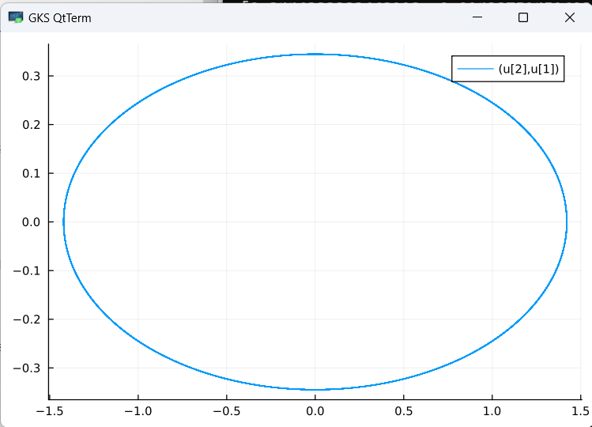
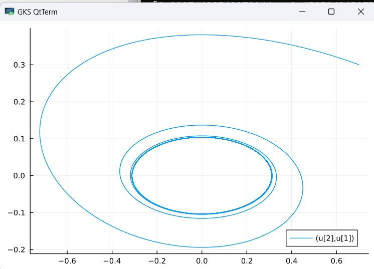

---
## Front matter
title: "Модель гармонических колебаний"
subtitle: "Лабораторная работа № 4"
author: "Шулуужук Айраана НПИбд-02-22"

## Generic otions
lang: ru-RU
toc-title: "Содержание"

## Bibliography
bibliography: bib/cite.bib
csl: pandoc/csl/gost-r-7-0-5-2008-numeric.csl

## Pdf output format
toc: true # Table of contents
toc-depth: 2
lof: true # List of figures
lot: true # List of tables
fontsize: 12pt
linestretch: 1.5
papersize: a4
documentclass: scrreprt
## I18n polyglossia
polyglossia-lang:
  name: russian
  options:
	- spelling=modern
	- babelshorthands=true
polyglossia-otherlangs:
  name: english
## I18n babel
babel-lang: russian
babel-otherlangs: english
## Fonts
mainfont: IBM Plex Serif
romanfont: IBM Plex Serif
sansfont: IBM Plex Sans
monofont: IBM Plex Mono
mathfont: STIX Two Math
mainfontoptions: Ligatures=Common,Ligatures=TeX,Scale=0.94
romanfontoptions: Ligatures=Common,Ligatures=TeX,Scale=0.94
sansfontoptions: Ligatures=Common,Ligatures=TeX,Scale=MatchLowercase,Scale=0.94
monofontoptions: Scale=MatchLowercase,Scale=0.94,FakeStretch=0.9
mathfontoptions:
## Biblatex
biblatex: true
biblio-style: "gost-numeric"
biblatexoptions:
  - parentracker=true
  - backend=biber
  - hyperref=auto
  - language=auto
  - autolang=other*
  - citestyle=gost-numeric
## Pandoc-crossref LaTeX customization
figureTitle: "Рис."
tableTitle: "Таблица"
listingTitle: "Листинг"
lofTitle: "Список иллюстраций"
lotTitle: "Список таблиц"
lolTitle: "Листинги"
## Misc options
indent: true
header-includes:
  - \usepackage{indentfirst}
  - \usepackage{float} # keep figures where there are in the text
  - \floatplacement{figure}{H} # keep figures where there are in the text
---

# Цель работы

Изучить понятие гармонического осциллятора, построить фазовый портрет и найти решение уравнения гармонического осциллятора.

# Теоретическое введение

- Гармонический осциллятор [1] — система, которая при смещении из положения равновесия испытывает действие возвращающей силы F, пропорциональной смещению x.

- Гармоническое колебание [2] - колебание, в процессе которого величины, характеризующие движение (смещение, скорость, ускорение и др.), изменяются по закону синуса или косинуса (гармоническому закону).

Движение грузика на пружинке, маятника, заряда в электрическом контуре, а также эволюция во времени многих систем в физике, химии, биологии и других науках при определенных предположениях можно описать одним и тем же дифференциальным уравнением, которое в теории колебаний выступает в качестве основной модели. Эта модель называется линейным гармоническим осциллятором.
Уравнение свободных колебаний гармонического осциллятора имеет следующий вид:
$$\ddot{x}+2\gamma\dot{x}+\omega_0^2=0$$

где $x$ - переменная, описывающая состояние системы (смещение грузика, заряд конденсатора и т.д.), $\gamma$ - параметр, характеризующий потери энергии (трение в механической системе, сопротивление в контуре), $\omega_0$ - собственная частота колебаний.
Это уравнение есть линейное однородное дифференциальное  уравнение второго порядка и оно является примером линейной динамической системы.

При отсутствии потерь в системе ( $\gamma=0$ ) получаем уравнение консервативного осциллятора энергия колебания которого сохраняется во времени.
$$\ddot{x}+\omega_0^2x=0$$

Для однозначной разрешимости уравнения второго порядка необходимо задать два начальных условия вида
 
$$
 \begin{cases}
	x(t_0)=x_0
	\\   
	\dot{x(t_0)}=y_0
 \end{cases}
$$

Уравнение второго порядка можно представить в виде системы двух уравнений первого порядка:
$$
 \begin{cases}
	x=y
	\\   
	y=-\omega_0^2x
 \end{cases}
$$

Начальные условия для системы примут вид:
$$
 \begin{cases}
	x(t_0)=x_0
	\\   
	y(t_0)=y_0
 \end{cases}
$$

Независимые	переменные	$x, y$	определяют	пространство,	в котором «движется» решение. Это фазовое пространство системы, поскольку оно двумерно будем называть его фазовой плоскостью. Значение фазовых координат $x, y$ в любой момент времени полностью определяет состояние системы. Решению уравнения движения как функции времени отвечает гладкая кривая в фазовой плоскости. Она называется фазовой траекторией. Если множество различных решений (соответствующих различным начальным условиям) изобразить на одной фазовой плоскости, возникает общая картина поведения системы. Такую картину, образованную набором фазовых траекторий, называют фазовым портретом.

# Задание

Определим вариант задания по формуле: (SnmodN)+1, где Sn — номер студбилета, N — количество заданий. В результате получаем вариант - 31 (рис. [-@fig:001])

{#fig:001 width=70%}

Вариант 31 

Построить фазовый портрет гармонического осциллятора и решение уравнения гармонического осциллятора для следующих случаев

1. Колебания гармонического осциллятора без затуханий и без действий внешней силы $\ddot{x}+17x=0$;
2. Колебания гармонического осциллятора c затуханием и без действий внешней силы $\ddot{x}+1.7\dot{x}+6x=0$
3. Колебания гармонического осциллятора c затуханием и под действием внешней силы $\ddot{x}+3.6\dot{x}+8x=0.6cos(3t)$

На интервале $t\in [0;66]$ (шаг $0.05$) с начальными условиями $x_0=0.3, y_0=0.7$.

# Выполнение лабораторной работы

Построим численное решение задачи на языке Julia.

Код программы для первого случая:

```
using DifferentialEquations
using Plots; gr()

function lorenz!(du, u, p, t)
    a = p
    du[1] = u[2]
    du[2] = -a*u[1]
end

const x = 0.3
const y = 0.7
u0 = [x, y]

p = (17)
tspan = (0.0, 66.0)
prob = ODEProblem(lorenz!, u0, tspan, p)
sol = solve(prob, dtmax = 0.05)

#решение системы уравнений
plot(sol)

#фазовый портрет
plot(sol, vars=(2,1))
```

Результаты для первого случая - Колебания гармонического осциллятора без затуханий и без действий внешней силы (рис. [-@fig:002]) (рис. [-@fig:003])

{#fig:002 width=70%}

{#fig:003 width=70%}


Код программы для второго случая:

```
using DifferentialEquations
using Plots; gr()

function lorenz!(du, u, p, t)
    a, b = p
    du[1] = u[2]
    du[2] = -a*du[1] - b*u[1] 
end

const x = 0.3
const y = 0.7
u0 = [x, y]

p = (sqrt(17), 6)
tspan = (0.0, 66.0)
prob = ODEProblem(lorenz!, u0, tspan, p)
sol = solve(prob, dtmax = 0.05)

#решение системы уравнений
plot(sol)

#фазовый портрет
plot(sol, vars=(2,1))
```

Результаты для второго случая - Колебания гармонического осциллятора c затуханием и без действий внешней
силы (рис. [-@fig:004]) (рис. [-@fig:005])

{#fig:004 width=70%}

{#fig:005 width=70%}

Код программы для третьего случая:

```
using DifferentialEquations

function lorenz!(du, u, p, t)
    a, b = p
    du[1] = u[2]
    du[2] = -a*du[1] - b*u[1] + 0.9*cos(10*t)
end

const x = 0.3
const y = 0.7
u0 = [x, y]

p = (sqrt(3.6), 8)
tspan = (0.0, 66.0)
prob = ODEProblem(lorenz!, u0, tspan, p)
sol = solve(prob, dtmax = 0.05)

#решение системы уравнений
plot(sol)

#фазовый портрет
plot(sol, vars=(2,1))
```

Результаты для третьего случая - Колебания гармонического осциллятора c затуханием и под действием внешней
силы (рис. [-@fig:006]) (рис. [-@fig:007])

{#fig:006 width=70%}

{#fig:007 width=70%}

# Выводы

В ходе выполнения лабораторной работы были построены решения уравнения гармонического осциллятора и фазовые портреты гармонических колебаний без затухания, с затуханием и при действии внешней силы на языках Julia

