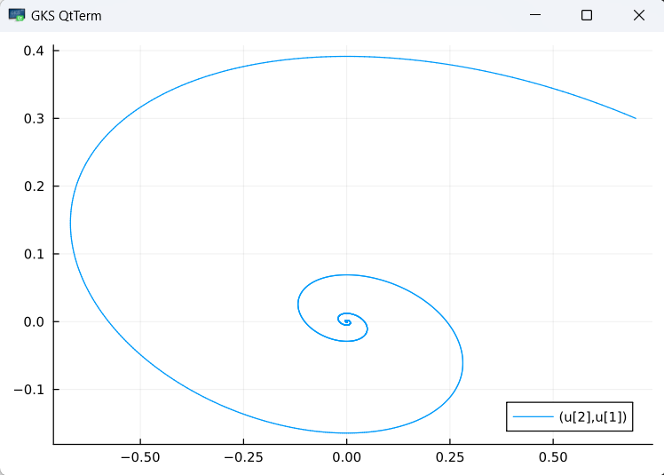
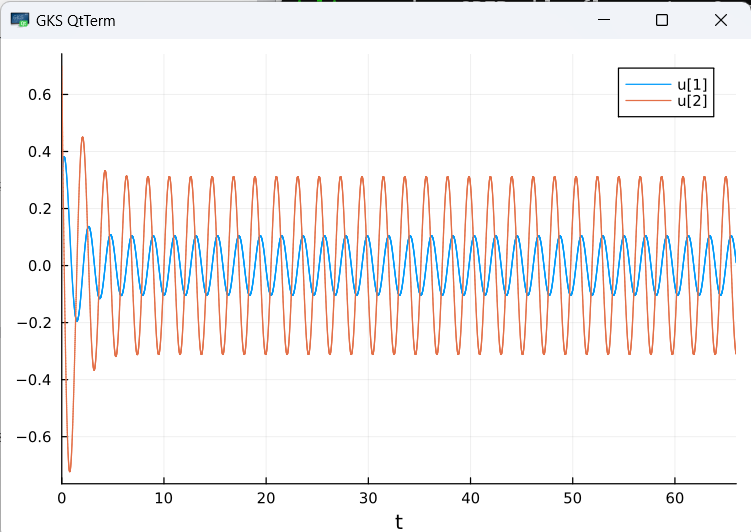

---
## Front matter
title: "Модель хищник-жертва"
subtitle: "Лабораторная работа № 5"
author: "Шулуужук Айраана НПИбд-02-22"

## Generic otions
lang: ru-RU
toc-title: "Содержание"

## Bibliography
bibliography: bib/cite.bib
csl: pandoc/csl/gost-r-7-0-5-2008-numeric.csl

## Pdf output format
toc: true # Table of contents
toc-depth: 2
lof: true # List of figures
lot: true # List of tables
fontsize: 12pt
linestretch: 1.5
papersize: a4
documentclass: scrreprt
## I18n polyglossia
polyglossia-lang:
  name: russian
  options:
	- spelling=modern
	- babelshorthands=true
polyglossia-otherlangs:
  name: english
## I18n babel
babel-lang: russian
babel-otherlangs: english
## Fonts
mainfont: IBM Plex Serif
romanfont: IBM Plex Serif
sansfont: IBM Plex Sans
monofont: IBM Plex Mono
mathfont: STIX Two Math
mainfontoptions: Ligatures=Common,Ligatures=TeX,Scale=0.94
romanfontoptions: Ligatures=Common,Ligatures=TeX,Scale=0.94
sansfontoptions: Ligatures=Common,Ligatures=TeX,Scale=MatchLowercase,Scale=0.94
monofontoptions: Scale=MatchLowercase,Scale=0.94,FakeStretch=0.9
mathfontoptions:
## Biblatex
biblatex: true
biblio-style: "gost-numeric"
biblatexoptions:
  - parentracker=true
  - backend=biber
  - hyperref=auto
  - language=auto
  - autolang=other*
  - citestyle=gost-numeric
## Pandoc-crossref LaTeX customization
figureTitle: "Рис."
tableTitle: "Таблица"
listingTitle: "Листинг"
lofTitle: "Список иллюстраций"
lotTitle: "Список таблиц"
lolTitle: "Листинги"
## Misc options
indent: true
header-includes:
  - \usepackage{indentfirst}
  - \usepackage{float} # keep figures where there are in the text
  - \floatplacement{figure}{H} # keep figures where there are in the text
---

# Цель работы

Построить простейшую модель взаимодействия двух видов типа «хищник — жертва» - модель Лотки-Вольтерры

# Теоретическое введение

- Модель Лотки—Вольтерры — модель взаимодействия двух видов типа «хищник — жертва», названная в честь её авторов, которые предложили модельные уравнения независимо друг от друга. Такие уравнения можно использовать для моделирования систем «хищник — жертва», «паразит — хозяин», конкуренции и других видов взаимодействия между двумя видами. [4]

Данная двувидовая модель основывается на
следующих предположениях [4]:

1. Численность популяции жертв x и хищников y зависят только от времени (модель не учитывает пространственное распределение популяции на занимаемой территории)

2. В отсутствии взаимодействия численность видов изменяется по модели Мальтуса, при этом число жертв увеличивается, а число хищников падает

3. Естественная смертность жертвы и естественная рождаемость хищника считаются несущественными

4. Эффект насыщения численности обеих популяций не учитывается

5. Скорость роста численности жертв уменьшается пропорционально численности хищников

$$
 \begin{cases}
	\frac{dx}{dt} = (-ax(t) + by(t)x(t))
	\\   
	\frac{dy}{dt} = (cy(t) - dy(t)x(t))
 \end{cases}
$$

В этой модели $x$ – число жертв, $y$ - число хищников.
Коэффициент $a$ описывает скорость естественного прироста числа жертв в отсутствие хищников, $с$ - естественное вымирание хищников, лишенных пищи в виде жертв.
Вероятность взаимодействия жертвы и хищника считается пропорциональной как количеству жертв, так и числу самих хищников ($xy$).
Каждый акт взаимодействия уменьшает популяцию жертв, но способствует увеличению популяции хищников (члены $-bxy$ и $dxy$ в правой части уравнения).

Математический анализ этой (жёсткой) модели показывает, что имеется стационарное состояние, всякое же другое начальное состояние приводит
к периодическому колебанию численности как жертв, так и хищников, так что по прошествии некоторого времени такая система вернётся в изначальное состояние.

Стационарное состояние системы (положение равновесия, не зависящее от времени решения) будет находиться
в точке $x_0=\frac{c}{d}, y_0=\frac{a}{b}$. Если начальные значения задать в стационарном состоянии $x(0) = x_0, y(0) = y_0$, то в любой момент времени
численность популяций изменяться не будет. При малом отклонении от положения равновесия численности как хищника, так и жертвы с течением времени не
возвращаются к равновесным значениям, а совершают периодические колебания вокруг стационарной точки. Амплитуда колебаний и их период определяется
начальными значениями численностей $x(0), y(0)$. Колебания совершаются в противофазе.

# Задание

Определим вариант задания по формуле: (SnmodN)+1, где Sn — номер студбилета, N — количество заданий. В результате получаем вариант - 31 (рис. [-@fig:001])

{#fig:001 width=70%}

Вариант 31 

Построить фазовый портрет гармонического осциллятора и решение уравнения гармонического осциллятора для следующих случаев

1. Колебания гармонического осциллятора без затуханий и без действий внешней силы $\ddot{x}+17x=0$;
2. Колебания гармонического осциллятора c затуханием и без действий внешней силы $\ddot{x}+1.7\dot{x}+6x=0$
3. Колебания гармонического осциллятора c затуханием и под действием внешней силы $\ddot{x}+3.6\dot{x}+8x=0.6cos(3t)$

На интервале $t\in [0;66]$ (шаг $0.05$) с начальными условиями $x_0=0.3, y_0=0.7$.

# Выполнение лабораторной работы

Построим численное решение задачи на языке Julia.

Код программы для первого случая:

```
using DifferentialEquations
using Plots; gr()

function lorenz!(du, u, p, t)
    a = p
    du[1] = u[2]
    du[2] = -a*u[1]
end

const x = 0.3
const y = 0.7
u0 = [x, y]

p = (17)
tspan = (0.0, 66.0)
prob = ODEProblem(lorenz!, u0, tspan, p)
sol = solve(prob, dtmax = 0.05)

#решение системы уравнений
plot(sol)

#фазовый портрет
plot(sol, vars=(2,1))
```

Результаты для первого случая - Колебания гармонического осциллятора без затуханий и без действий внешней силы (рис. [-@fig:002]) (рис. [-@fig:003])

{#fig:002 width=70%}

{#fig:003 width=70%}


Код программы для второго случая:

```
using DifferentialEquations
using Plots; gr()

function lorenz!(du, u, p, t)
    a, b = p
    du[1] = u[2]
    du[2] = -a*du[1] - b*u[1] 
end

const x = 0.3
const y = 0.7
u0 = [x, y]

p = (sqrt(17), 6)
tspan = (0.0, 66.0)
prob = ODEProblem(lorenz!, u0, tspan, p)
sol = solve(prob, dtmax = 0.05)

#решение системы уравнений
plot(sol)

#фазовый портрет
plot(sol, vars=(2,1))
```

Результаты для второго случая - Колебания гармонического осциллятора c затуханием и без действий внешней
силы (рис. [-@fig:004]) (рис. [-@fig:005])

{#fig:004 width=70%}

{#fig:005 width=70%}

Код программы для третьего случая:

```
using DifferentialEquations

function lorenz!(du, u, p, t)
    a, b = p
    du[1] = u[2]
    du[2] = -a*du[1] - b*u[1] + 0.9*cos(10*t)
end

const x = 0.3
const y = 0.7
u0 = [x, y]

p = (sqrt(3.6), 8)
tspan = (0.0, 66.0)
prob = ODEProblem(lorenz!, u0, tspan, p)
sol = solve(prob, dtmax = 0.05)

#решение системы уравнений
plot(sol)

#фазовый портрет
plot(sol, vars=(2,1))
```

Результаты для третьего случая - Колебания гармонического осциллятора c затуханием и под действием внешней
силы (рис. [-@fig:006]) (рис. [-@fig:007])

{#fig:006 width=70%}

{#fig:007 width=70%}

# Выводы

В ходе выполнения лабораторной работы были построены решения уравнения гармонического осциллятора и фазовые портреты гармонических колебаний без затухания, с затуханием и при действии внешней силы на языках Julia

