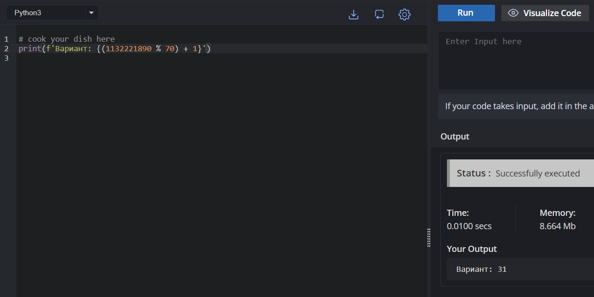
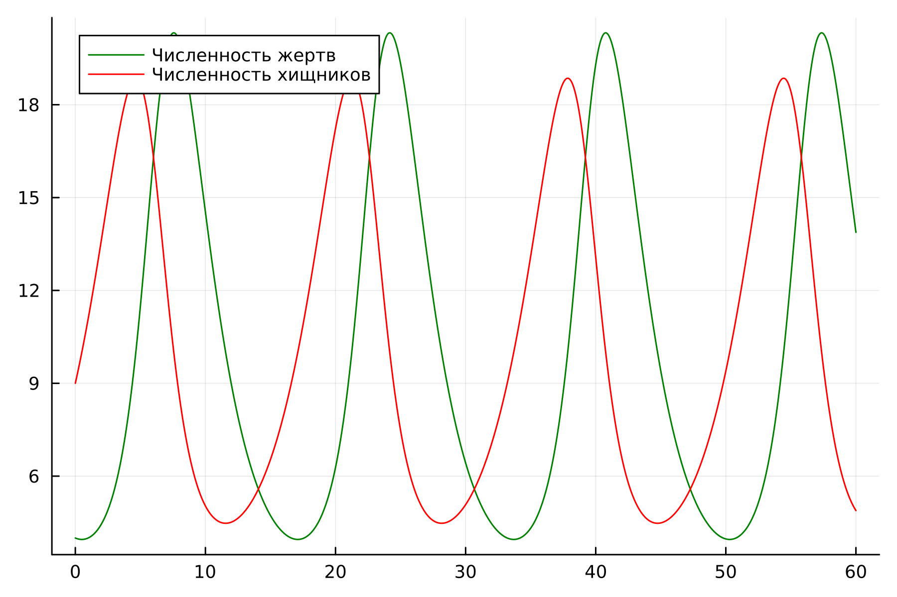

---
## Front matter
lang: ru-RU
title: Модель конкуренции двух фирм.
subtitle: Лабораторная работа № 8
author:
  - Шулуужук А. В.
institute:
  - Российский университет дружбы народов, Москва, Россия
date: 04 апрель 2025

## i18n babel
babel-lang: russian
babel-otherlangs: english

## Formatting pdf
toc: false
toc-title: Содержание
slide_level: 2
aspectratio: 169
section-titles: true
theme: metropolis
header-includes:
 - \metroset{progressbar=frametitle,sectionpage=progressbar,numbering=fraction}
 - '\makeatletter'
 - '\beamer@ignorenonframefalse'
 - '\makeatother'
---

## Цели и задачи

Изучить и построить простейшую модель конкуренции двух фирм

# Выполнение лабораторной работы

## Определение номера варианта задания 

{#fig:001 width=70%}

## Задание

Для модели «хищник-жертва»:

$$
 \begin{cases}
	\frac{dx}{dt} = -0.45x(t) + 0.045x(t)y(t)
	\\   
	\frac{dy}{dt} = 0.35y(t) - 0.035x(t)y(t))
 \end{cases}
$$

Построить график зависимости численности хищников от численности жертв, а также графики изменения численности хищников и численности жертв при следующих начальных условиях: $x_0=4, y_0=9$. Найдите стационарное
состояние системы.

## Нестационарное состояние

Код программы для нестационарного состояния:

```
using DifferentialEquations
using Plots;

x0 = 4
y0 = 9

a = 0.45
b = 0.045
c = 0.35
d = 0.035

function ode_fn(du, u, p, t)
    x, y = u
    du[1] = -a *u[1] + b * u[1]u[2]
    du[2] = c * u[2] - d * u[1]u[2]
end

v0 = [x0, y0]

tspan = (0.0, 60.0)
prob = ODEProblem(ode_fn, v0, tspan)
sol = solve(prob, dtmax = 0.05)

X = [u[1] for u in sol.u]
Y = [u[2] for u in sol.u]
T = [t for t in sol.t]

plt = plot(dpi = 300, legend = false)

plot!(plt, X, Y, color=:red)

savefig(plt, "lab5_jl_1.png")

plt2 = plot(dpi = 300, legend = true)

plot!(plt2, T, X, label="Численность жертв", color=:red)

plot!(plt2, T, Y, label="Численность хищников", color=:green)

savefig(plt, "lab5_jl_2.png")
```

##

{#fig:002 width=70%}

##

{#fig:003 width=70%}

## Стационарное состояние

Код программы для стационарного состояния:

```
using DifferentialEquations
using Plots;

a = 0.45
b = 0.045
c = 0.35
d = 0.035

x0 = c / d
y0 = a / b

function ode_fn(du, u, p, t)
    x, y = u
    du[1] = -a *u[1] + b * u[1]u[2]
    du[2] = c * u[2] - d * u[1]u[2]
end

v0 = [x0, y0]

tspan = (0.0, 60.0)
prob = ODEProblem(ode_fn, v0, tspan)
sol = solve(prob, dtmax = 0.05)

X = [u[1] for u in sol.u]
Y = [u[2] for u in sol.u]
T = [t for t in sol.t]

plt2 = plot(dpi = 300, legend = true)

plot!(plt2, T, X, label="Численность жертв", color=:red)

plot!(plt2, T, Y, label="Численность хищников", color=:green)

savefig(plt, "lab5_jl_3.png")
```

##

{#fig:004 width=70%}

# Выводы

В ходе выполнения лабораторной работы были построены графики зависимости численности хищников от численности жертв, а также графики изменения численности хищников и жертв на языке Julia
